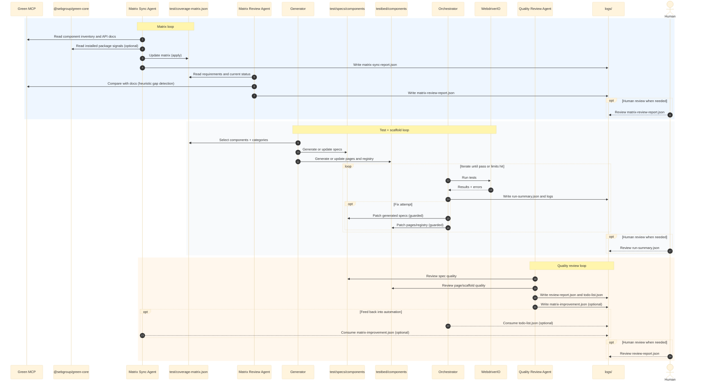

# Architecture Plan: Green Testbed + Coverage + Agentic Workflows

Created: 2026-01-26  
Status: Active (living document)

## Goal

Provide a scalable testbed architecture for Green Design System web components with:

- a single source of truth for coverage requirements and status
- repeatable component/scenario pages for stable automation
- automated maintenance workflows that keep pace with `@sebgroup/green-core`

## System Overview

This repo consists of four cooperating layers:

1. **Testbed UI (Vite + Lit + Green web components)**
   - Hosts component showcase pages and scenario pages.
   - Provides stable URLs and selectors for automation.

2. **Test execution (WebdriverIO + BrowserStack + Visual service)**
   - Runs specs across desktop/mobile capabilities.
   - Supports visual baselines (progressively enabled).

3. **Coverage tracking (coverage matrix + validation/report scripts)**
   - `test/coverage-matrix.json` defines: what must be tested, where pages/specs live, and status.
   - Scripts validate integrity and produce summary reports.

4. **Agentic workflows (Copilot SDK + Green MCP)**
   - Agents read Green MCP docs and repo state to:
     - keep the matrix in sync
     - generate/update pages and tests
       - review tests for quality issues and produce actionable todos

## Data Flow (high level)

- Green MCP (authoritative) → component inventory + API metadata
- Copilot SDK connects to Green MCP via `mcpServers` (no bespoke MCP client wrapper)
- Optional: installed `@sebgroup/green-core` exports → sanity check only
- Agent(s) → propose/update `test/coverage-matrix.json`
- Agent(s) → generate/maintain `testbed/components/*` and `test/specs/components/*`
- WDIO → executes tests → diffs/artifacts (visual diffs, logs)
- Review agent → emits review findings/todos → stored as per-run reports under `logs/`
- Review agent → updates a small “quality summary” in `test/coverage-matrix.json` (optional fields)

## Solution anatomy (diagram)

## Principles

- **Matrix as source of truth** for coverage requirements and status.
- **Stable automation surfaces**: component pages expose stable IDs/attributes for selectors.
- **Human-in-the-loop**: generated changes move statuses to `review` until confirmed.
- **Incremental rollout**: enable heavier checks (visual + accessibility + more platforms) gradually.

## Interfaces (contracts)

- **Routing contract**: there is a canonical component-page URL format used by all specs and generators.
- **Matrix contract**: each component entry must reference existing `testbedPage` and `testSpec` paths.
- **Agent contract**: agents must use tools (matrix/docs/repo inspection) and should never silently change broad parts of the repo.

## Non-goals (for now)

- Full “auto-merge” automation. Generated changes require review.
- Perfect static proof that tests cover every matrix requirement (we aim for practical audit signals first).
